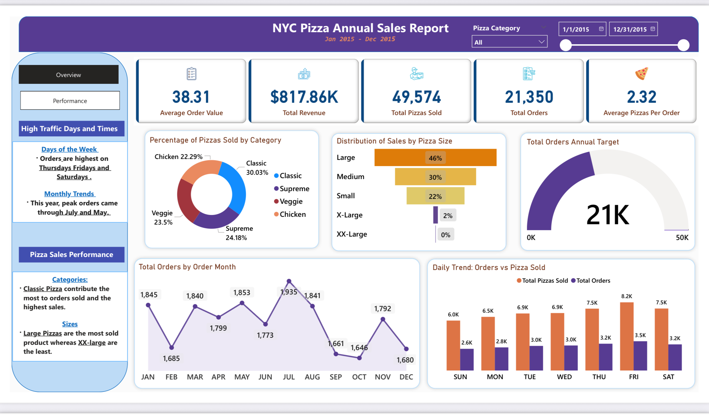
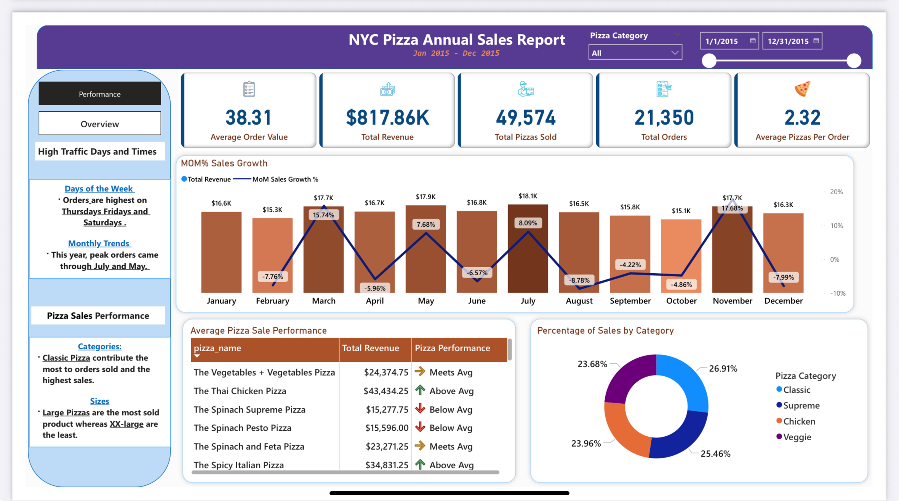

# NYC Pizza Annual Sales Report: Interactive Dashboard

Power BI dashboard analyzing one year of pizza sales data in NYC to uncover trends, track key performance indicators (KPIs), and support data-driven business decisions.

## Objective
Analyze one year of pizza sales to provide insights into revenue, order trends, and product performance. The goal is to help stakeholders optimize promotions, inventory, and sales strategies.

## Tech Stack
- **Database:** MS SQL Server
- **Visualization:** Power BI  
- **Calculations:** DAX for KPIs and trend analysis  
- **Data Analysis:** SQL for queries and data modeling  

--

## Dashboard Features
**KPIs (Cards):**  
- Average Order Value  
- Total Revenue  
- Total Pizzas Sold  
- Total Orders  
- Average Pizzas per Order  

**Visualizations:**  
- Pie Chart: Percentage of pizzas sold by category  
- Bar Graph: Daily order trends (orders placed vs pizzas sold)  
- Area Chart: Total orders by month  
- Funnel Chart: Distribution of sales by pizza size  
- Gauge: Total orders vs annual target  
- MoM Chart: Month-over-month sales growth  
- Performance Table: Average Pizza Sale Performance  

## Dashboard Pages 
Here are the pages from the dashboard:/

**Overview: Orders Made vs Sold**  

**Sales and Inventory Performance**  

## Key Findings
	- Customers average 2.32 pizzas per order, showing multi-item purchasing behavior.
	- Fridays drive peak demand with ~8.2K pizzas sold and ~3.5K orders placed.
	- Summer months (May–July) show the strongest seasonal order volumes.
	- November achieved the highest MoM growth (+17.68%), signaling a strong promotional or seasonal impact.
	- Veggie pizzas contribute 23.86% of revenue, but many vegetarian SKUs underperform → excess variety may be inflating costs.

## Business Suggestion Strategies 
	- Optimize product mix: Reduce low-performing vegetarian SKUs to cut costs without impacting revenue.
	- Leverage peak periods: Target promotions and upsell strategies around Fridays and summer months.
	- Investigate November growth drivers: Double down on successful campaigns or seasonal promotions.
	- Enhance customer insights: Segment by repeat vs. new buyers to refine targeting.
	- Forecast demand: Build predictive models for seasonal sales planning and inventory optimization

