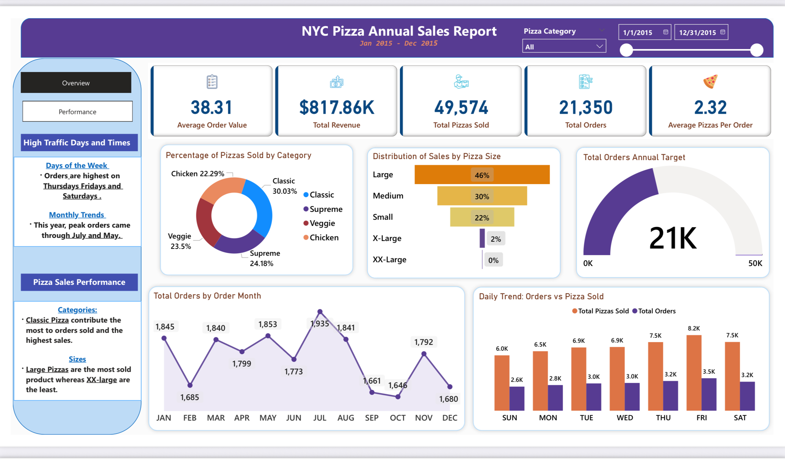
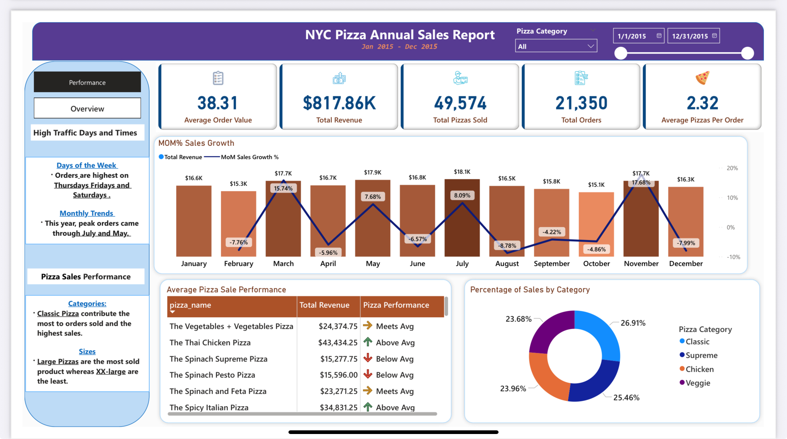

# NYC Pizza Annual Sales Report: Interactive Dashboard

## Overview
An interactive Power BI dashboard analyzing one year of pizza sales data in NYC to uncover trends, track key performance indicators (KPIs), and provide actionable business insights.  

This project demonstrates my ability to design dashboards, calculate KPIs, use SQL, and translate data into business recommendations.

## Objective
Analyze one year of sales data to identify:
- Revenue drivers  
- Order and seasonal trends  
- Product category performance  
- Customer purchase behavior  

The ultimate goal is to support data-driven decisions for promotions, inventory management, and sales strategy.

## Tech Stack
- **Database:** MS SQL Server, Data Modeling   
- **Visualization:** Power BI  
- **Calculations:** DAX (KPI and trend analysis)  
- **Data Analysis:** SQL (queries, joins, data modeling) 

## Dashboard Features
**KPIs (Cards):**  
- Average Order Value (AOV) 
- Total Revenue  
- Total Pizzas Sold  
- Total Orders  
- Average Pizzas per Order  

**Visualizations:**  
- Pie Chart: Percentage of pizzas sold by category  
- Bar Graph: Daily order trends (orders placed vs pizzas sold)  
- Area Chart: Total orders by month  
- Funnel Chart: Distribution of sales by pizza size  
- Gauge: Total orders vs annual target  
- MoM Chart: Month-over-month sales growth  
- Performance Table: Average Pizza Sale Performance  

## Dashboard Pages 
Here are the pages from the dashboard:/

**Overview: Orders Made vs Sold**  

**Sales and Inventory Performance**  

## Detailed Findings:
 **Orders per Customer**
   - The average order contains 2.32 pizzas. Customers often buy multiple items, showing bundled purchasing behavior. This indicates opportunities to create bundle promotions or upsells. Optimizing offers around multi-item purchases can help increase revenue.  

 **Day of Week Trends**
   - Fridays see the highest activity, with around 8.2K pizzas sold and 3.5K orders. Demand peaks before weekends, reflecting weekly customer behavior. This insight suggests targeting promotions or loyalty offers on Fridays. Aligning campaigns with peak days can maximize sales 

 **Seasonality**
   - May through July have the strongest seasonal order volumes. Summer months consistently outperform other periods. This indicates that demand is influenced by holidays or social gatherings. Marketing spend and campaigns should align with these seasonal peaks.

 **Product Mix**
   - Veggie pizzas make up 23.9% of revenue, but several SKUs underperform. Excess variety inflates costs without driving revenue. Streamlining low-performing SKUs can reduce costs while maintaining sales. Focus should be on high-performing products to improve profitability.
 
 **Promotional Impact**
    - November saw a +17.7% month-over-month growth. This spike suggests a successful seasonal promotion or campaign. Identifying the drivers of this growth can help replicate results. Future promotions should leverage these insights for maximum impact. 

## Next Steps
- Incorporate customer segmentation (new vs. repeat buyers)  
- Connect marketing spend data to assess campaign ROI  
- Use predictive analytics to forecast seasonal demand  

## Business Suggestion Strategies 
- Optimize product mix: Reduce low-performing vegetarian SKUs to cut costs without impacting revenue.
- Leverage peak periods: Target promotions and upsell strategies around Fridays and summer months.
- Investigate November growth drivers: Double down on successful campaigns or seasonal promotions.
- Enhance customer insights: Segment by repeat vs. new buyers to refine targeting.
- Forecast demand: Build predictive models for seasonal sales planning and inventory optimization

## Limitations
- Data is limited to sales transactions (no customer demographics or marketing spend).  
- Cannot directly attribute sales lifts to specific campaigns without integrated marketing data.  

